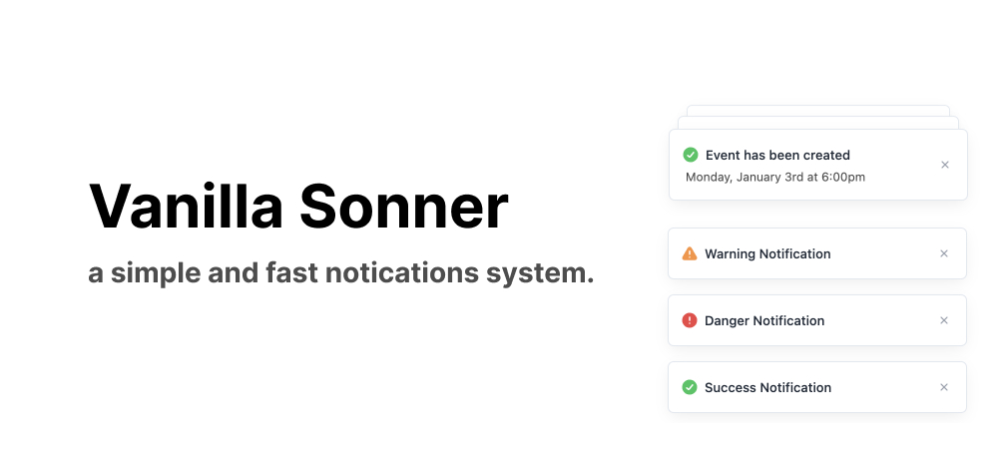

### vanilla-sonner


**Note:** This is a highly experimental project. Do not use it in production yet as it is a work in progress.

## Quick Start

### Include via CDN

Include the following script tag in your HTML to load `vanilla-sonner` from the CDN:

```html
<script src="https://cdn.jsdelivr.net/gh/Porter-smith/vanilla-sonner@main/dist/vanilla-sonner.min.js"></script>
```

### Basic Usage

Add the following buttons to your HTML to trigger different types of toasts:

```html
<div id="buttonContainer">
  <button class="styled-button" id="successButton">Success</button>
  <button class="styled-button" id="infoButton">Info</button>
  <button class="styled-button" id="warningButton">Warning</button>
  <button class="styled-button" id="dangerButton">Danger</button>
  <button class="styled-button" id="promiseButton">Promise</button>
</div>
```

Add event listeners to trigger the toasts:

```html
<script>
  document
    .getElementById("successButton")
    .addEventListener("click", function () {
      window.dispatchEvent(
        new CustomEvent("toast-show", {
          detail: {
            message: "Success Notification",
            type: "success",
            position: "bottom-right",
          },
        })
      );
    });

  document.getElementById("infoButton").addEventListener("click", function () {
    window.dispatchEvent(
      new CustomEvent("toast-show", {
        detail: {
          message: "Info Notification",
          type: "info",
          position: "bottom-right",
        },
      })
    );
  });

  document
    .getElementById("warningButton")
    .addEventListener("click", function () {
      window.dispatchEvent(
        new CustomEvent("toast-show", {
          detail: {
            message: "Warning Notification",
            type: "warning",
            position: "bottom-right",
          },
        })
      );
    });

  document
    .getElementById("dangerButton")
    .addEventListener("click", function () {
      window.dispatchEvent(
        new CustomEvent("toast-show", {
          detail: {
            message: "Danger Notification",
            type: "danger",
            position: "bottom-right",
          },
        })
      );
    });

  document
    .getElementById("promiseButton")
    .addEventListener("click", function () {
      const promise = new Promise((resolve, reject) => {
        setTimeout(() => {
          resolve("Promise Resolved");
        }, 2000);
      });

      window.dispatchEvent(
        new CustomEvent("toast-show", {
          detail: {
            message: "Loading...",
            type: "default",
            promise,
          },
        })
      );

      promise
        .then((result) => {
          window.dispatchEvent(
            new CustomEvent("toast-show", {
              detail: {
                message: result,
                type: "success",
                position: "bottom-right",
              },
            })
          );
        })
        .catch((error) => {
          window.dispatchEvent(
            new CustomEvent("toast-show", {
              detail: {
                message: error,
                type: "danger",
                position: "bottom-right",
              },
            })
          );
        });
    });
</script>
```

### Features

#### Default Toast

Create a basic toast with a message:

```js
window.dispatchEvent(
  new CustomEvent("toast-show", {
    detail: {
      message: "Event has been created",
      type: "default",
    },
  })
);
```

#### Success Toast

Create a success toast with a checkmark icon:

```js
window.dispatchEvent(
  new CustomEvent("toast-show", {
    detail: {
      message: "Event has been created",
      type: "success",
    },
  })
);
```

#### Info Toast

Create an info toast with a question mark icon:

```js
window.dispatchEvent(
  new CustomEvent("toast-show", {
    detail: {
      message: "Event has new information",
      type: "info",
    },
  })
);
```

#### Warning Toast

Create a warning toast with a warning icon:

```js
window.dispatchEvent(
  new CustomEvent("toast-show", {
    detail: {
      message: "Event has a warning",
      type: "warning",
    },
  })
);
```

#### Error Toast

Create an error toast with an error icon:

```js
window.dispatchEvent(
  new CustomEvent("toast-show", {
    detail: {
      message: "Event has not been created",
      type: "danger",
    },
  })
);
```

### Custom Toast

Create a custom toast with additional description:

```js
window.dispatchEvent(
  new CustomEvent("toast-show", {
    detail: {
      message: "Event has been created",
      description: "Monday, January 3rd at 6:00pm",
      type: "default",
    },
  })
);
```

### Action Toast

Create a toast with an action button:

```js
window.dispatchEvent(
  new CustomEvent("toast-show", {
    detail: {
      message: "Event has been created",
      type: "default",
      action: {
        label: "Undo",
        onClick: () => console.log("Undo"),
      },
    },
  })
);
```

### Promise Toast

Create a toast that starts in a loading state and updates based on a promise:

```js
const promise = new Promise((resolve, reject) => setTimeout(resolve, 2000));

window.dispatchEvent(
  new CustomEvent("toast-show", {
    detail: {
      message: "Loading...",
      type: "default",
      promise,
    },
  })
);

promise
  .then(() => {
    window.dispatchEvent(
      new CustomEvent("toast-show", {
        detail: {
          message: "Success",
          type: "success",
        },
      })
    );
  })
  .catch(() => {
    window.dispatchEvent(
      new CustomEvent("toast-show", {
        detail: {
          message: "Error",
          type: "danger",
        },
      })
    );
  });
```

### References

This project was inspired by and uses concepts from the following projects:

- [Pines Toast Documentation](https://devdojo.com/pines/docs/toast)
- [Sonner by Emil Kowalski](https://github.com/emilkowalski/sonner)
- [Svelte-Sonner by Wobsoriano](https://github.com/wobsoriano/svelte-sonner)
